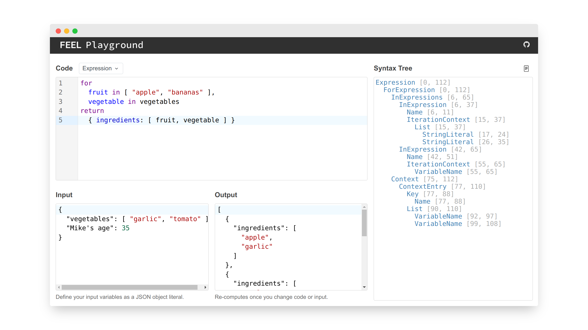

# feel-playground

An interactive app to try out and learn the DMN FEEL language in your browser.

Check it out [in action](https://nikku.github.io/feel-playground).

## Related

* [Feelin](https://github.com/nikku/feelin) - a FEEL parser and interpreter written in JavaScript
